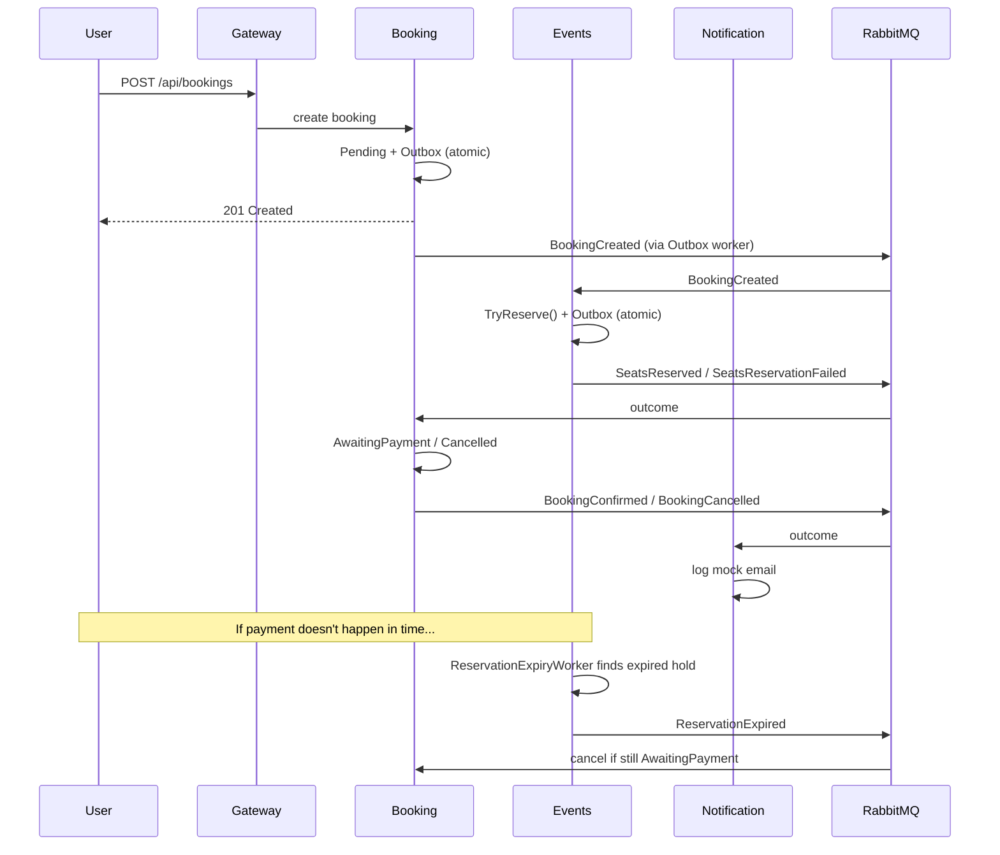

# TicketFlow

Event ticket booking platform built as .NET microservices - a distributed transaction and event-driven saga, done properly: Outbox pattern, idempotent consumers, TTL-based compensation, optimistic concurrency, and a race condition or two found and fixed along the way.

Built as a learning project to go deep on distributed systems patterns that don't show up in typical CRUD work — race conditions, compensation, message delivery guarantees.

## Why this domain

Event ticketing has a real race condition at its core: limited seats, concurrent bookings, a payment window that can time out. That's not incidental complexity — it's the reason this project exists.

## Architecture

Three services, one gateway, one saga.



**Events** owns the resource — event catalog, seat count, reservation holds. Doesn't know who's buying or what they paid.

**Booking** owns user intent — the booking lifecycle, snapshot data (price, title) so "my bookings" works even if Events is down, the payment step.

**Notification** is a pure side-effect consumer — no business database beyond its own idempotency table.

**Gateway** (YARP) is the single entry point, with CORS for the frontend.

Each service talks to the others only through RabbitMQ events and one deliberate synchronous exception: Booking calls Events' HTTP API to fetch authoritative price/title at booking time, rather than trusting the client.

## Screenshots


## What makes this more than CRUD-with-extra-steps

**Symmetric Outbox pattern, both directions.** Every service that publishes an event writes it to its own `OutboxMessage` table in the *same transaction* as the state change, and a separate polling worker publishes to RabbitMQ. This isn't just Booking → Events; Events' own consumer does the same thing back to Booking. Found and closed mid-development: a version *without* symmetric Outbox on the consumer side had a silent-message-loss window if `PublishAsync` failed after the DB commit but before publish — the idempotency record was already written, so retries got silently swallowed.

**TTL saga with two independent compensation paths.** A reservation hold expires in 5 minutes (30s in Development, for testable demos). Two things can cancel it:
- **Automatic** — `ReservationExpiryWorker` polls for expired holds, releases seats, publishes `ReservationExpired`.
- **Explicit** — the user cancels, which publishes `SeatsReleaseRequested`.

Both converge on the same idempotent guard in `Booking.Cancel()`: only from `Pending`/`AwaitingPayment`, no-op otherwise. Whoever gets there first wins; the loser's message is silently absorbed rather than throwing.

**A real EF Core bug, caught by a real bug report, not a test.** A newly created `Reservation` with a client-generated GUID key, reached via navigation from an already-tracked `Event`, got misclassified by EF's navigation-fixup heuristic as `Modified` instead of `Added` — causing `DbUpdateConcurrencyException` on *every* delivery, which triggered an infinite `nack`/`requeue` loop (reproduced at ~345 msg/s against a stuck RabbitMQ queue). Root-caused and fixed with an explicit `EntityState.Added` assignment.

**A payment/expiry race, closed properly.** For a while, `Reservation.Status` on the Events side never learned about a successful payment — it stayed `Held` forever, meaning `ReservationExpiryWorker` would eventually release seats for an *already-sold ticket*. Fixed by publishing `BookingConfirmed` with the `ReservationId`, and a new Events-side consumer that marks the reservation `Confirmed`, excluding it from the expiry worker's filter — no changes needed to the worker itself.

**Client doesn't get to set its own price.** `POST /api/bookings` originally accepted `pricePerTicket` and `eventTitle` straight from the request body — trivially exploitable via devtools. Fixed: Booking calls Events' API server-side and uses the authoritative values.

**Mutation-tested unit tests.** 65 domain unit tests, verified not just by passing but by deliberately breaking two guards (`Event.Release`'s status check, `Booking.Pay`'s status check) and confirming the tests actually catch the break — then reverting.

**Redis cache with the right boundary.** `GET /api/events` (catalog) is cached, no TTL, invalidated on `Create`/`Publish`. `GET /api/events/{id}` (with live seat count) is deliberately *not* cached — caching a number that changes on every booking would either be wrong or would require invalidating on every reservation, defeating the point.

## Tech stack

**Backend:** .NET 10, ASP.NET Core, EF Core (Npgsql), MediatR (CQRS on the Booking write side), RabbitMQ.Client, StackExchange.Redis, YARP.

**Frontend:** React 19, TypeScript, Vite, TanStack Query (polling for async saga state), React Router, Tailwind 4, shadcn/ui, framer-motion.

**Infra:** Docker (multi-stage builds, 4 .NET services + frontend), Postgres × 3 (database-per-service), RabbitMQ, Redis, GitHub Actions CI.

## Running it

Everything, one command:

```bash
docker compose up --build
```

Brings up 3× Postgres, RabbitMQ, Redis, all four .NET services, and the frontend. Migrations and sample-data seeding run automatically on container start (gated behind explicit flags, off by default for local `dotnet run`).

| What | Where |
|---|---|
| Frontend | http://localhost:5173 |
| API Gateway | http://localhost:8080 |
| RabbitMQ management UI | http://localhost:15672 |

For local development without Docker (faster iteration, hot reload): bring up just the infrastructure —

```bash
docker compose up -d events-db booking-db notification-db rabbitmq redis
```

— then `dotnet run` each service from its own project, and `npm run dev` in `frontend/`.

## Testing

```bash
dotnet test
```

65 unit tests on the domain layer (`Event`/`Reservation`/`Booking` state machines), no database or message broker required. Runs on every PR via GitHub Actions.

## Project structure

```
src/
  Gateway/
    TicketFlow.Gateway/               YARP reverse proxy
  Services/
    Booking/
      TicketFlow.Booking.Api/
      TicketFlow.Booking.Application/
      TicketFlow.Booking.Domain/
      TicketFlow.Booking.Infrastructure/
    Events/
      TicketFlow.Events.Api/
      TicketFlow.Events.Application/
      TicketFlow.Events.Domain/
      TicketFlow.Events.Infrastructure/
    Notification/
      TicketFlow.Notification.Api/    consumer-only, no domain layer
  Shared/
    TicketFlow.Contracts/             integration event contracts
frontend/                             React app
tests/                                domain unit tests, per service
```
---

Built by Oleg Ponа
